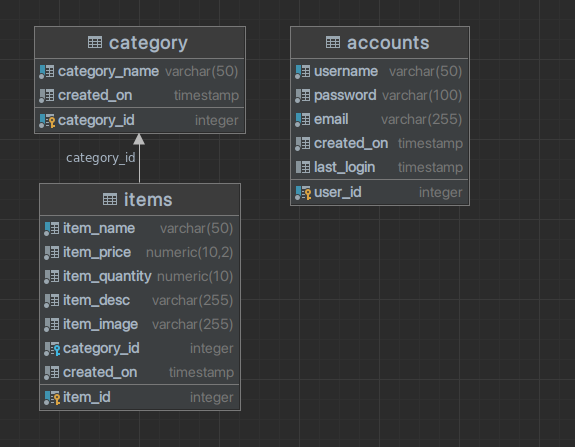

## Table of contents

- [Quick start](#quick-start)
- [What's included](#whats-included)
- [Database Config](#database-config)

## Quick start

To get started with the project, you can simply clone this repository and install the dependencies.

- Startup your backend

```shell
$ cd server
$ npm install
$ npm run dev
```

- Startup your frontend

```shell
$ cd client
$ npm install
$ npm run start
```

## What's included

- [x] Create an Item
- [x] Read an/all Item
- [x] Update an Item
- [x] Delete an Item
- [x] Authenticate Admin User
- [x] Normal User View
- [x] Admin User View
- [ ] Protected RESTAPIs with Bearer token
- [ ] Option to update Item's Category
- [ ] AWS integration for image uploading

## Database Config



